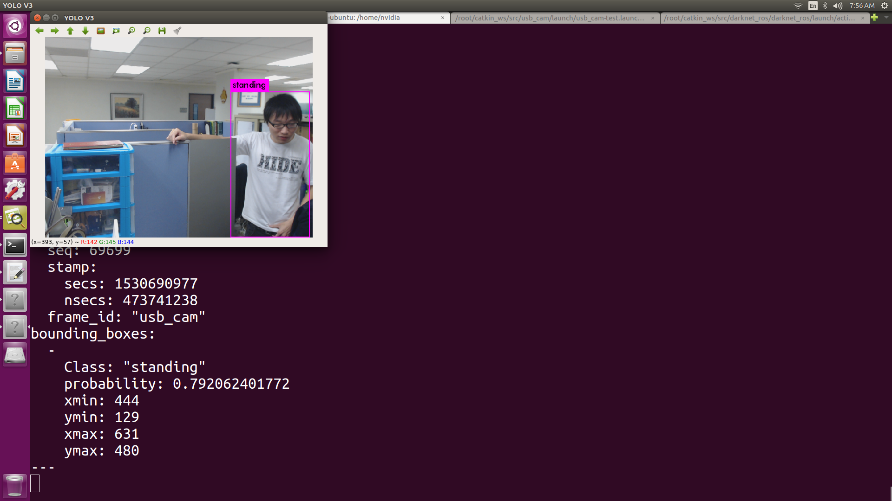
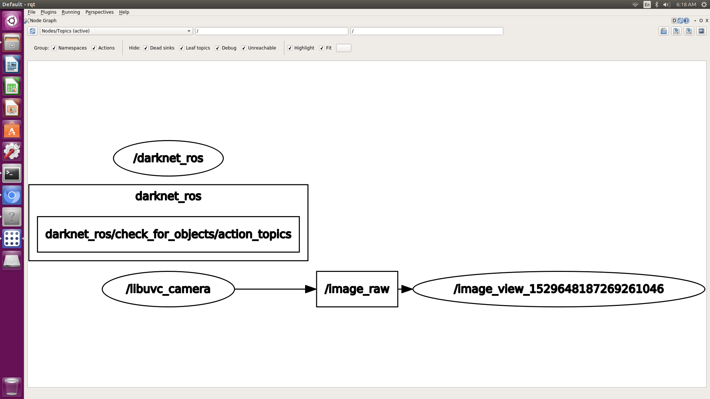
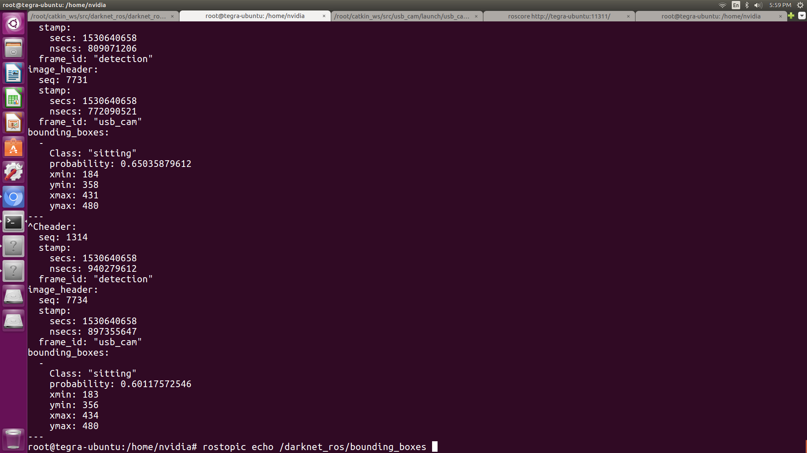

# Falling detection at Darknet ROS Nvidia Tx2
Deep learning framework I tried moving object recognition by YOLO (You only look once) feature quantity of darknet, connecting ROS wrapper package "darknet_ros" with WEB camera.
darknet_ros "was created by Robotic Systems Lab of ETH Zurich (Zurich Technical University).

(see [darknet_ros](https://github.com/leggedrobotics/darknet_ros))

(see [darknet](https://github.com/pjreddie/darknet))

Ret1):  類別代號: Class 0:standing ,1:sitting  ,2:falling

Ret2):  百分比:  Probability(%)

Ret3):  坐標:  Cordinator(xmin, ymin, xmax, ymax) == (46, 202, 127, 127)


```bash
$ bounding_boxes:
  -
    Class: "sitting"
    probability: 0.345575362444
    xmin: 190
    ymin: 369
    xmax: 448
    ymax: 480
---​
```

Installation of Falling detection....
=====================================

- Install TensorFlow (see [tensor flow install guide](https://www.tensorflow.org/install/install_linux))
- Install ROS (see http://wiki.ros.org)
- InstallROSTX2 (see https://github.com/jetsonhacks/installROSTX2)
    - updateRepositories.sh
    - installROS.sh
    - setupCatkinWorkspace.sh
- Install ROS's catkin-tools.
Now you can use the catkin build command.

```bash
$ sudo apt-get install python-catkin-tools`

- Download darknet and compile with catkin.

```bash
$ mkdir -p ~/catkin_darknet/src
$ cd ~/catkin_ws/src
$ git clone --recursive https://github.com/leggedrobotics/darknet_ros.git
```

# Patching modify file
Now you can use the catkin build command.
```
$ cd ~/catkin_ws/src/darknet_ros/darknet_ros/

$ patch -p6 < ../../darknetRos/e2.patch
$ ...result
1.)patching file config/ros.yaml
2.)patching file config/yolo-action.yaml
3.)patching file launch/actionYolo_ros.launch
4.)patching file yolo_network_config/cfg/yolo-action.cfg

## . == ~/catkin_ws/src/darknet_ros/darknet_ros
$cp file yolo_network_config/weights/yolo-action_final.weights .

$ ...result
5).yolo_network_config/weights/yolo-action_final.weights

$ cd ../ (==> ~/catkin_ws)
$ catkin build darknet_ros /(or) catkin_make
```


# Start up
How to try at first,
```bash
$ source /root/catkin_ws/devel/setup.bash
$ roscore
```

Next step, you might choose as below one of setting to finish all process
```bash
(1).
$ rosrun libuvc_camera camera_node image_raw:=image_raw
$ rosrun image_view image_view image:=image_raw

$ vi /root/catkin_ws/src/darknet_ros/darknet_ros/config/ros.yaml
  camera_reading:
  topic: /image_raw

$ roslaunch darknet_ros actionYolo_ros.launch
```
Equeal to
```bash
(2).
$ rosrun usb_cam usb_cam_node image_raw:=/usb_cam/image_raw
$ rosrun image_view image_view image:=/usb_cam/image_raw

$ vi /root/catkin_ws/src/darknet_ros/darknet_ros/config/ros.yaml
  camera_reading:
  topic: /usb_cam/image_raw

$ roslaunch darknet_ros actionYolo_ros.launch
```
Equeal to
```bash
(3).
$ roslaunch usb_cam usb_cam-test.launch

$ vi /root/catkin_ws/src/darknet_ros/darknet_ros/config/ros.yaml
  camera_reading:
  topic: /usb_cam/image_raw

$ roslaunch darknet_ros actionYolo_ros.launch
```


# Message
```
$ rostopic echo  /darknet_ros/bounding_boxs
---
bounding_boxes:
  -
    Class: "sitting" // object identification
    probability: 0.782561951876 // likelihood
    xmin: 69 // upper left coordinate of bounding Box of object
    ymin: 0 // upper left coordinate of object bounding Box
    xmax: 640 // coordinate of lower right corner of bounding
    ymax: 480 // coordinate of lower right corner of bounding Box of object
---

$ rostopic echo  /darknet_ros/found_object
$ rostopic echo  /darknet_ros/detection_image
```


# ROS + Darknet
----------------


# RQT
----------------



# Rostopic
----------------


~~Ref~~
=======
***